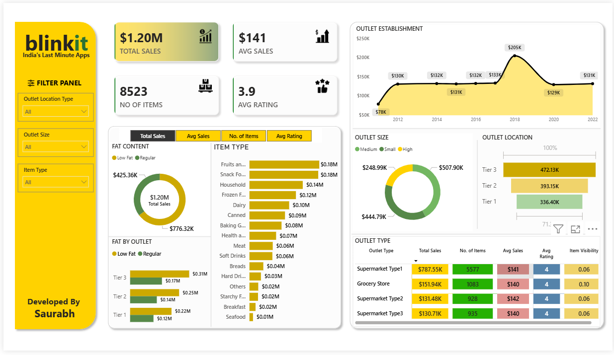
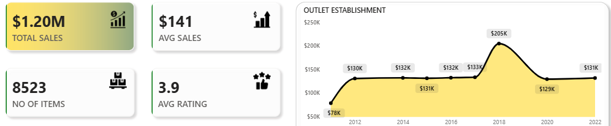
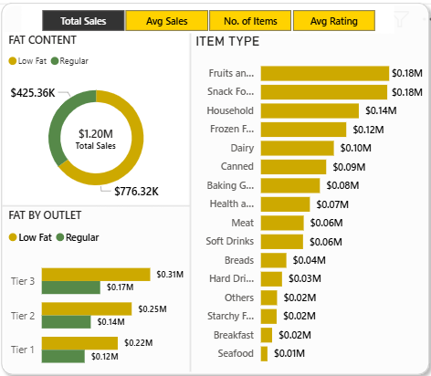

# Blinkit Sales Dashboard – Exce, Python, SQL & Power BI Project

---

## 📊 Project Overview
This project analyzes Blinkit's sales performance using SQL for data extraction and transformation, and Power BI for interactive visualization and business insight generation.

The objective was to design a clean, interactive, and business-focused dashboard to support data-driven decision-making.

---

## 🗄 Data Preparation (SQL)

- Data cleaning and transformation using SQL
- Aggregation of sales metrics
- Joins across multiple datasets
- Preparing structured dataset for Power BI analysis

SQL file included: `sql-queries.sql`

---

## 📈 Dashboard Features

- KPI Cards (Total Sales, Average Sales, Items Sold, Ratings)
- Sales Trend Analysis
- Outlet Size & Location Comparison
- Item Type Performance Analysis
- Fat Content Distribution
- Interactive Filters & Slicers

---

## 🚀 Key Insights

- Total Sales: $1.20M
- Average Sales: $141
- Total Items Sold: 8,523
- Average Rating: 3.9

---

## 🛠 Tools & Technologies Used
- Python
- SQL
- Ms Excel
- Power BI
- DAX
- Data Modeling
- Data Visualization Best Practices

---

## 📸 Additional Dashboard Views

### KPI & Sales Trend

### Category & Outlet Analysis

---

## 📌 Developed By

Saurabh  
Data Analyst
